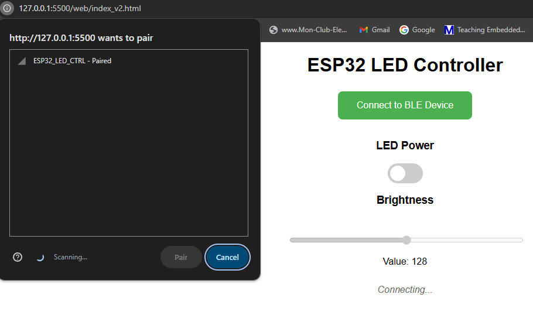

# ESP32 BLE LED Controller

A simple Bluetooth Low Energy (BLE) controller for ESP32 that allows wireless control of an LED's power state and brightness through a web interface.

## Features
- Turn LED on/off via BLE
- Adjust brightness (0-255 range)
- Clean, responsive web interface
- Real-time status updates
- Cross-platform compatibility (works on desktop/mobile)

## Web Interface Overview
The intuitive web interface provides:
- Connection status indicator
- Toggle switch for power control
- Slider for brightness adjustment
- Current value display
- One-click BLE pairing

(Note: Add the actual `image.png` file to your repository in the same directory as README.md)
